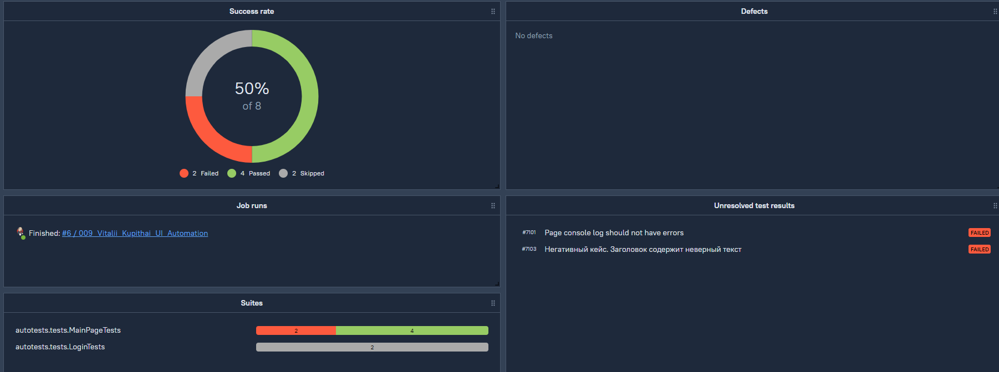
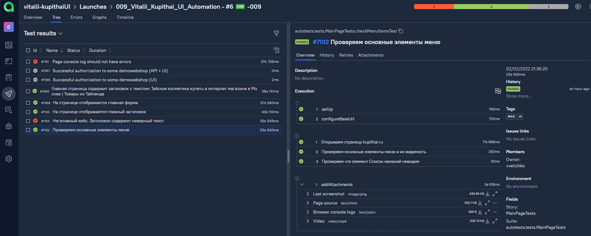
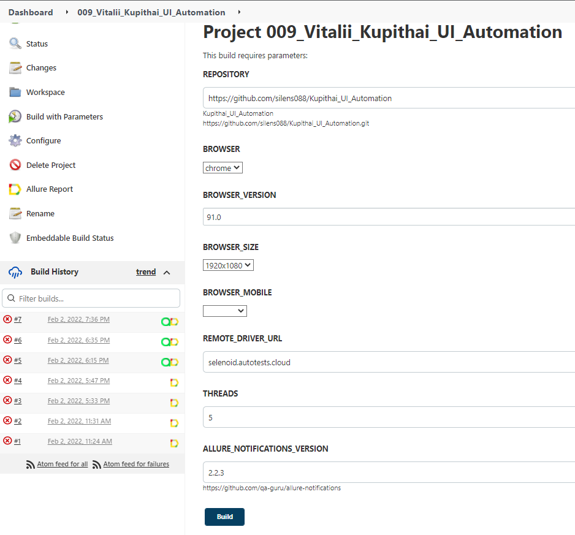
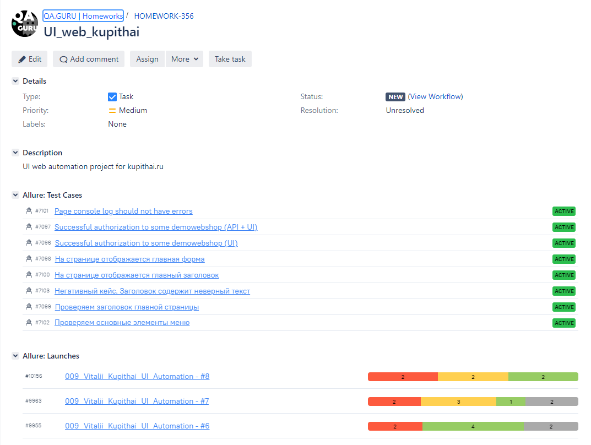
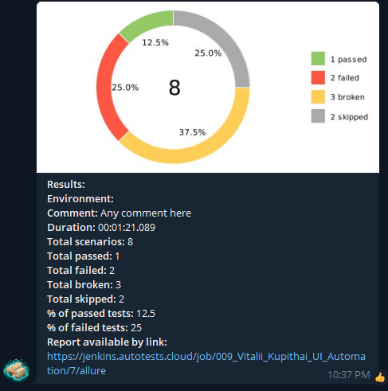

# UI web automation проект для сайта [kupithai.ru](https://kupithai.ru/)

## Технологический стек:

| Java | Selenide | Gradle | Junit5 | Selenoid | Jenkins | IntelliJ IDEA | Allure Report | Allure Testops | Telegram |
|:------:|:----:|:------:|:------:|:--------:|:--------:|:-------------:|:---------:|:---------:|:--------:|
|  |  |  |  |  |  |  |  |  |  |


## Параметры запуска

Для удаленного запуска тестов, необходимо заполнить remote.properties следующими данными:

* browser (default chrome)
* browserVersion (default 89.0)
* browserSize (default 1920x1080)
* browserMobileView (mobile device name, for example iPhone X)
* remoteDriverUrl (url address from selenoid or grid)
* videoStorage (url address where you should get video)
* threads (number of threads)

Run tests with filled remote.properties:
```bash
gradle clean -DremoteDriverUrl=https://%s:%s@selenoid.autotests.cloud/wd/hub/ -DvideoStorage=https://selenoid.autotests.cloud/video/ -Dthreads=1 test
```

Run tests locally:
```bash
gradle clean test
```

Serve report:
```bash
allure serve build/allure-results
```


## Отчёты о прохождении автотестов и хранение документации организовано в Allure TestOps

Click <a target="_blank" href="https://allure.autotests.cloud/project/968/dashboards">here</a> to see a list of automated test cases.

Отчет о прохождении тестов:



Обзор тестового прогона:




## Удаленный запуск тестов возможен через - Jenkins job

Click <a target="_blank" href="https://jenkins.autotests.cloud/job/009_Vitalii_Kupithai_UI_Automation/">here</a> to do that.



## Настроена Интерграция с Jira




## Оповещение о прохождении тестов приходит в Telegram bot

